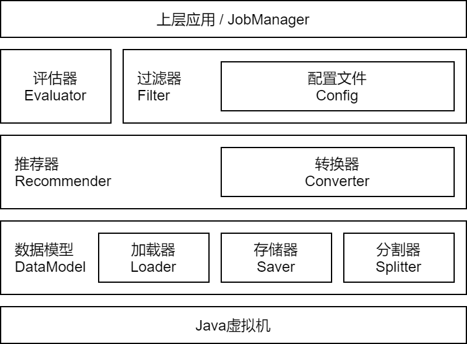

[toc]

# 初步架构设计

## 概述

首先通过使用方式来介绍本项目中的常用类

~~~java
// DataModel-数据模型类
// 创建时需指定加载器、存储器、分割器
// 可以在创建时载入，也可以在之后的任何时候载入

// 在创建时载入
DataModel data = new BasicDataModel(
    // 选择合适的加载器，并指定数据集所在磁盘位置
    new BasicMatrixLoader("D:\\in.csv"),

    // 选择合适的存储器，并指定数据集所在磁盘位置
    new BasicMareixSaver("D:\\out.csv"),

    // 选择合的适分割器
    new BasicSplitter()
).load();

// 构建推荐器 -> 将已加载或未加载的数据集传给推荐器的构造函数即可
// 可在创建时做训练和预测，也可在之后的任何时候做
// 在推荐器中，可对DataModel使用转换器进行转换
// 如特征向量转为相似矩阵

// 在创建时做训练和预测
Recommendable recommender = new BasicRecommender(data)
    							.train()
    							.predict();

// 单独做预测
recommender.predict();

// 构建评估器，将推荐器传入评估器构造函数即可完成构建
// 可在构造时进行评估，也可在之后的任意时间调用evaluate()进行评估

// 构造评估器并评估
Evaluatable evaluator = new BasicEvaluator(recommender).evaluate();

// 单独做评估
evaluator.evaluate();

// 获取评估结果
System.out.println(evaluator.getResult());

// 将推荐结果传入过滤器构造函数，构建过滤器
Filtable filter = new BasicFilter(recommender.getResult());

// 创建另一个过滤器，以便演示合并操作
Filtable anotherFilter = new BasicFilter(null);

// 可以流式计算，将结果使用多种配置文件进行过滤和合并
filter.filt(null)
      .filt(null)
      .merge(anotherFilter)
      .filt(null)
      .merge(filter);
    

/****************************************************************/
// 以上除评估器以外的所有操作，均可通过一句话嵌套完成
// 一句话完成数据的载入、分割、推荐和过滤操作
Filtable out = new BasicFilter(
    new BasicRecommender(
        new BasicDataModel(
            new BasicMatrixLoader(""),
            new BasicMareixSaver(""),
            new BasicSplitter()
        ).load()
    ).train()
     .predict()
     .getResult()
).filt(null)
 .filt(null)
 .merge(new BasicFilter(null));
~~~

## 接口详细介绍

### 加载器

从CSV、Arff、数据库等不同主流数据输入渠道载入多种数据模型。

矩阵加载器示例

~~~java
// 导入基础数据模型 -> 矩阵类
import cn.cuc.grec.math.structure.Matrix;

// 创建加载器 -> 继承自抽象加载器(其已实现部分功能)
public class BasicMatrixLoader extends AbstractLoader {
	// 构造函数传入文件或数据库参数信息
    public BasicMatrixLoader(String url) {
        super(url);
    }
	
    // 重载load函数，修改返回值至所需数据类型
    @Override
    public Matrix load() {
        // 加载数据所需操作
        ...
        return 加载完成的矩阵;
    }
}
~~~

### 存储器

将现有数据模型导出为CSV、Arff、数据库等不同主流格式。

矩阵存储器示例

~~~java
// 导入基础数据模型 -> 矩阵类
import cn.cuc.grec.math.structure.Matrix;
// 创建存储器 -> 继承自抽象存储器(其已实现部分功能)
public class BasicMareixSaver extends AbstractSaver {
	// 构造函数传入文件或数据库参数信息
    public BasicMareixSaver(String url) {
        super(url);
    }
	
    // 重载save函数
    @Override
    public void save(Object o) {
        // 首先将Object类型强制转换为所需类型
        // 记得判断getClass信息，以免抛出异常
        Matrix m = (Matrix)o;
        // 存储相关代码
        ...
    }
}
~~~

### 分割器

将现有输入数据进行分割(按比例分割、随机分割等)。

分割器示例

~~~java
// 导入基础数据模型
import cn.cuc.grec.math.structure.DataSet;
// 创建分割器 -> 继承自抽象分割器(其已实现部分功能)
public class BasicSplitter extends AbstractSplitter{
    // 构造函数传入数据集
    public BasicSplitter(DataSet inData) {
        super(inData);
    }
	
    // 构造函数 -> 稍后传入数据集
    public BasicSplitter() {
        super();
    }
	
    // 重载split(分割)函数
    @Override
    public void split(DataSet inData) {
        // 将目标数据集载入分割器
        this.inData = inData;
        // 分割操作 -> 将结果赋值给trainData和predictData
        ...
    }
}
~~~

### 转换器

提供数据集之间的映射和转换关系。比如用户特征向量到用户相似度矩阵的转换。

转换器示例

~~~java
// 导入基础数据模型
import cn.cuc.grec.data.DataModel;
// 创建转换器 -> 继承自抽象转换器(其已实现部分功能)
public class BasicConverter extends AbstractConverter {
	// 构造函数传入数据集
    public BasicConverter(DataModel in) {
        super(in);
    }
	
    // 重载转换函数
    @Override
    public void convert() {
	    // 将this.in进行适当转换 -> 并赋值给this.out
        this.out = ...;
    }
}
~~~

### 推荐器

算法实现层，将输入数据集经过推荐算法 -> 计算出推荐结果

推荐器示例

~~~java
// 导入推荐错误异常
import cn.cuc.grec.commom.GrecException;
// 导入基础数据模型
import cn.cuc.grec.data.DataModel;
// 创建推荐器 -> 继承自抽象推荐器(其已实现部分功能)
public class BasicRecommender extends AbstractRecommender {
	// 构造函数传入数据模型
    public BasicRecommender(DataModel data) {
        super(data);
    }
	
    // 重载训练函数 -> 返回this，以实现流式计算
    @Override
    public Recommendable train() throws GrecException {
		// 训练集通过this.data.getTrainData()得到
        ...
        return this;
    }
	
    // 重载预测函数 -> 返回this，以实现流式计算
    @Override
    public Recommendable predict() throws GrecException {
        // 预测数据集通过this.data.getPredictData()得到
        // 结果存储至this.result
		...
        return this;
    }
	
    // 重载载入推荐器函数 -> 返回this，以实现流式计算
    @Override
    public Recommendable loadRecommender() throws GrecException {
		...
        return this;
    }
	
    // 重载载入推荐器函数(保存此次训练结果，下次直接使用训练好的模型)
    // 返回this，以实现流式计算
    @Override
    public Recommendable saveRecommender() throws GrecException {
		...
        return this;
    }
	
    //重载推荐结束后所必要的清理工作 -> 返回this，以实现流式计算
    @Override
    public Recommendable cleanUp() throws GrecException {
		... 
        return this;
    }
}
~~~

### 过滤器

将推荐结果按配置文件进行筛选、排序、合并

过滤器示例

~~~java
// 导入配置文件
import cn.cuc.grec.conf.Configurable;
// 导入数据模型
import cn.cuc.grec.data.DataModel;
// 创建过滤器 -> 继承自抽象过滤器(其已实现部分功能)
public class BasicFilter extends AbstractFilter {
	// 构造函数传入数据模型
    public BasicFilter(DataModel data) {
        super(data);
    }
	
    // 重载载入过滤函数 -> 返回this，以实现流式计算
    @Override
    public Filtable filt(Configurable conf) {
        return this;
    }
	
    // 重载载入合并函数 -> 返回this，以实现流式计算
    @Override
    public Filtable merge(Filtable f) {
        return this;
    }
}
~~~

### 评估器

对推荐器的训练结果进行评估。

评估器示例

~~~java
// 导入推荐器
import cn.cuc.grec.recommender.Recommendable;
// 创建评估器 -> 继承自抽象评估器(其已实现部分功能)
public class BasicEvaluator extends AbstractEvaluator {
	// 构造函数传入推荐器
    public BasicEvaluator(Recommendable recommender) {
        super(recommender);
    }
	
    // 重载评估函数 -> 返回this，以实现流式计算
    @Override
    public Evaluatable evaluate() {
        // 推荐器通过this.recommender获得
		...
        return this;
    }
}
~~~
